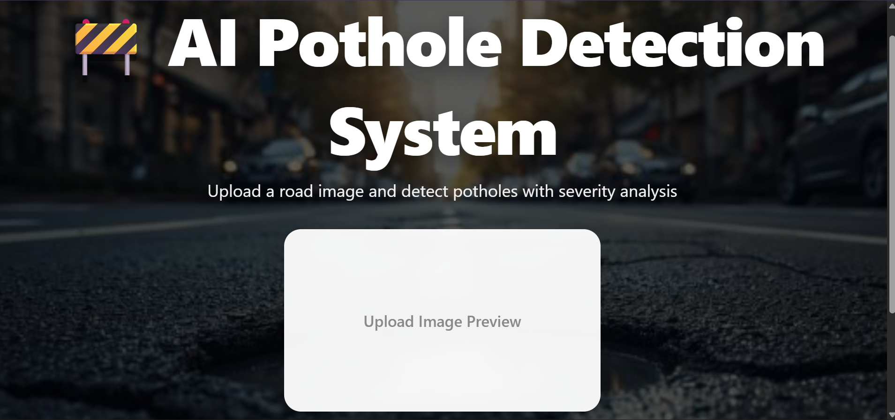
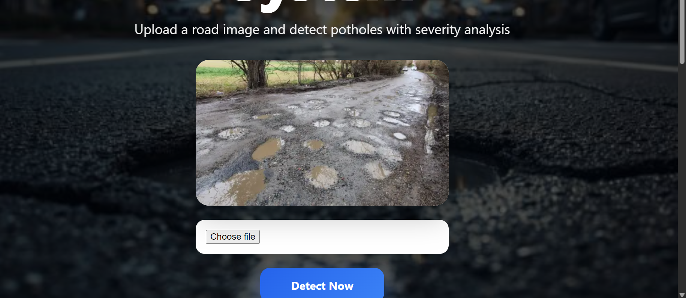
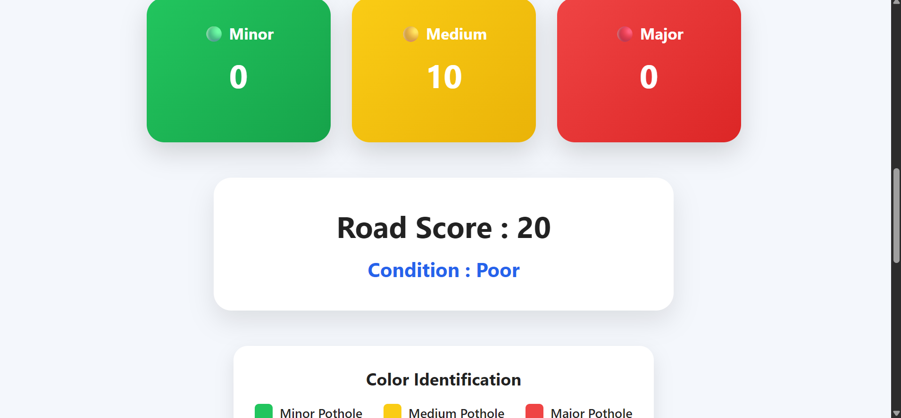

# 🚧 AI-Based Pothole Detection and Road Condition Analysis System

## Overview

The AI-Based Pothole Detection and Road Condition Analysis System is a computer vision application developed using **YOLOv8**, **Flask**, and **OpenCV**. The system automatically detects potholes from uploaded road images, classifies them based on severity, and provides an overall road condition assessment.

The project aims to assist road maintenance authorities in identifying damaged road segments efficiently and reducing manual inspection efforts.

---

## Features

* Detection of potholes from road images.
* Classification into:

  * Minor Pothole
  * Medium Pothole
  * Major Pothole
* Color-coded bounding boxes:

  * 🟢 Green → Minor Pothole
  * 🟡 Yellow → Medium Pothole
  * 🔴 Red → Major Pothole
* Automatic Road Score Calculation.
* Road Condition Analysis:

  * Good
  * Moderate
  * Poor
* Modern Flask-based Web Interface.
* Image Preview Before Detection.
* Responsive User Interface.

---

## Technologies Used

### Frontend

* HTML5
* CSS3
* JavaScript

### Backend

* Flask (Python)

### Computer Vision & AI

* YOLOv8
* OpenCV
* Ultralytics

### Dataset Processing

* LabelImg
* Custom Annotated Dataset

---

## Project Structure

```text
Pothole-Detection-System/
│
├── app.py
├── dataset.yaml
├── train.py
├── predict.py
│
├── My Dataset/
│   ├── train/
│   ├── valid/
│   └── test/
│
├── runs/
│   └── detect/
│       └── train-4/
│           └── weights/
│               └── best.pt
│
├── static/
│   ├── bg.jpg
│   ├── result.jpg
│   └── style.css
│
├── templates/
│   └── index.html
│
└── README.md
```

---

## Model Training

The pothole detection model was trained using YOLOv8 on a custom dataset containing annotated potholes.

### Classes

1. Minor Pothole
2. Medium Pothole
3. Major Pothole

### Training Configuration

* Model: YOLOv8
* Epochs: 100
* Image Size: 640 × 640
* Framework: Ultralytics YOLO

The trained model is stored as:

```text
best.pt
```

---

## Working of the System

### Step 1: Upload Image

The user uploads a road image through the web interface.

### Step 2: Object Detection

YOLOv8 processes the image and detects potholes.

### Step 3: Severity Classification

Each detected pothole is classified into:

* Minor
* Medium
* Major

### Step 4: Road Score Calculation

Road Score is calculated using:

```python
Road Score = Minor + (Medium × 2) + (Major × 3)
```

### Step 5: Road Condition Analysis

| Road Score | Condition |
| ---------- | --------- |
| 0 – 3      | Good      |
| 4 – 8      | Moderate  |
| > 8        | Poor      |

### Step 6: Display Results

The application displays:

* Detected pothole counts
* Road score
* Road condition
* Color-coded detection image

---

## Detection Color Legend

| Color     | Severity       |
| --------- | -------------- |
| 🟢 Green  | Minor Pothole  |
| 🟡 Yellow | Medium Pothole |
| 🔴 Red    | Major Pothole  |

---

## Web Application

The Flask application provides:

* Image Upload
* Detection Preview
* Severity Statistics
* Road Score Dashboard
* Detection Visualization

Run the application using:

```bash
python app.py
```

Then open:

```text
http://127.0.0.1:5000
```

---
## System Demonstration

### Web Application Interface

The following image shows the working of the AI-Based Pothole Detection System. The system detects potholes, classifies them into severity levels, calculates the road score, and displays the overall road condition.
## System Demonstration

### Home Page

The landing page of the AI-Based Pothole Detection System where users can upload road images for analysis.



---

### Detection Results Dashboard

The system displays the total number of Minor, Medium, and Major potholes along with the calculated road score and road condition.



---

### Pothole Detection Output

The uploaded road image is processed using YOLOv8 and potholes are highlighted using color-coded bounding boxes based on severity.


### Road Condition Analysis

)
## Future Improvements

* Real-time pothole detection using video streams.
* GPS integration for pothole location mapping.
* Automatic road maintenance reports.
* Mobile application deployment.
* Cloud-based monitoring dashboard.
* Larger and more diverse training datasets.

---

## Limitations

* Detection accuracy depends on dataset quality.
* Extremely small or unclear potholes may not be detected.
* Performance may vary under poor lighting conditions.
* False positives can occur on road cracks and shadows.

---

## Author

Lagnadeep Samal

B.Tech Student

Artificial Intelligence & Computer Vision Project
